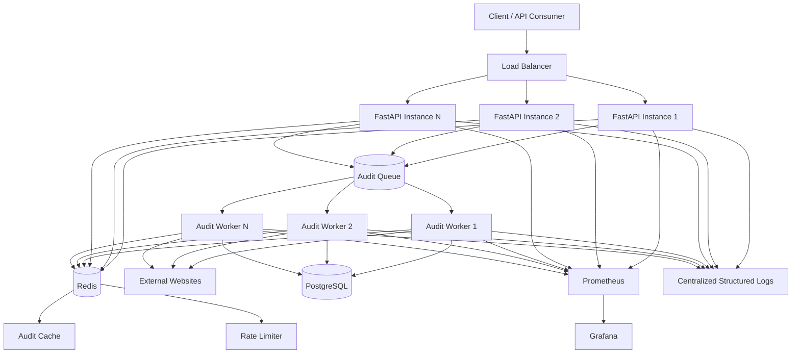

# Page Pulse — Scalable Architecture

## 1. Executive Summary

Page Pulse is a URL audit service that accepts a URL, checks its availability and response behavior, and returns a structured audit result.

Task B requires the service to be designed for:

* 10,000 audits per day
* Bursts of up to 500 concurrent requests
* A customer-facing response-time SLA
* Reliable operation under external website failures
* Monitoring, alerting, and safe rollback of bad deployments

The key architectural decision is to separate the API layer from the expensive URL-audit workload.

The API layer accepts and validates requests, while a queue distributes audit jobs to dedicated workers.

```text
Client
   ↓
Load Balancer
   ↓
FastAPI API Instances
   ↓
Redis Cache / Rate Limiting
   ↓
Audit Queue
   ↓
Audit Workers
   ↓
External Websites
```

This architecture allows the API and workers to scale independently.

---

# 2. Requirements and Assumptions

## 2.1 Expected Workload

The service must support:

* Approximately 10,000 audits per day
* Bursts of up to 500 concurrent audit requests
* External websites with unpredictable response times
* Repeated audits of the same URLs
* Customer-facing response-time expectations

The average daily traffic is relatively small compared with the possible burst traffic. Therefore, the main scaling challenge is not the daily average but the ability to safely absorb sudden traffic spikes.

---

## 2.2 Customer-Facing SLA

For this architecture, the following target SLA is proposed:

> **95% of successfully completed audit requests should complete within 5 seconds under normal operating conditions.**

This is represented as:

```text
P95 audit response time ≤ 5 seconds
```

The SLA should be measured continuously rather than relying only on average response time.

For example:

```text
100 requests

95 requests → Complete within 5 seconds
5 requests  → May take longer
```

The system should also monitor P50 and P99 latency to understand typical and worst-case user experiences.

---

## 2.3 Architecture Assumptions

The design assumes:

* API instances can be horizontally scaled.
* API instances should remain stateless.
* External websites are unreliable dependencies.
* Audit requests may take several seconds.
* The queue must absorb temporary traffic bursts.
* Shared state must not depend on the memory of a single API instance.
* The system should fail gracefully when dependencies are unavailable.

---

# 3. High-Level Architecture

The proposed architecture consists of the following components:

```text
                         ┌────────────────────┐
                         │       Client       │
                         │ Browser / API User │
                         └──────────┬─────────┘
                                    │
                                    ▼
                         ┌────────────────────┐
                         │   Load Balancer    │
                         └──────────┬─────────┘
                                    │
                 ┌──────────────────┼──────────────────┐
                 ▼                  ▼                  ▼
          ┌─────────────┐    ┌─────────────┐    ┌─────────────┐
          │ FastAPI API │    │ FastAPI API │    │ FastAPI API │
          │   Instance 1│    │   Instance 2│    │   Instance N│
          └──────┬──────┘    └──────┬──────┘    └──────┬──────┘
                 │                  │                  │
                 └──────────────────┼──────────────────┘
                                    │
                                    ▼
                         ┌────────────────────┐
                         │       Redis        │
                         │ Cache + Rate Limit │
                         └──────────┬─────────┘
                                    │
                                    ▼
                         ┌────────────────────┐
                         │    Audit Queue     │
                         └──────────┬─────────┘
                                    │
                 ┌──────────────────┼──────────────────┐
                 ▼                  ▼                  ▼
          ┌─────────────┐    ┌─────────────┐    ┌─────────────┐
          │   Worker 1  │    │   Worker 2  │    │   Worker N  │
          └──────┬──────┘    └──────┬──────┘    └──────┬──────┘
                 │                  │                  │
                 └──────────────────┼──────────────────┘
                                    │
                                    ▼
                         ┌────────────────────┐
                         │  External Websites │
                         └────────────────────┘

                         ┌────────────────────┐
                         │    PostgreSQL      │
                         │  Durable Metadata  │
                         └────────────────────┘

                         ┌────────────────────┐
                         │ Prometheus/Grafana │
                         │ Metrics & Dashboards│
                         └────────────────────┘

                         ┌────────────────────┐
                         │ Centralized Logs   │
                         │ Structured Logging │
                         └────────────────────┘
```

---

# 4. Architecture Diagram

The following Mermaid diagram represents the complete system:



---

# 5. Component Responsibilities

## 5.1 Client

The client sends an audit request.

Example:

```http
POST /audit
```

```json
{
  "url": "https://example.com"
}
```

The client should not need to know whether the request is processed by:

* One worker
* Ten workers
* Multiple API instances

This allows the internal architecture to evolve without changing the public API contract.

---

## 5.2 Load Balancer

The load balancer distributes incoming requests across multiple API instances.

```text
Request 1 → API Instance 1
Request 2 → API Instance 2
Request 3 → API Instance 3
Request 4 → API Instance 1
```

This prevents one API instance from becoming a single bottleneck.

If an API instance becomes unhealthy, the load balancer should stop sending traffic to it.

---

## 5.3 FastAPI API Instances

The API layer is responsible for:

1. Receiving requests
2. Validating input
3. Generating or propagating request IDs
4. Applying rate limits
5. Checking the cache
6. Creating audit jobs
7. Returning results or structured errors

The API instances should remain stateless.

This means important shared information should not exist only in local Python memory.

Bad design:

```text
API 1 → Local Cache A
API 2 → Local Cache B
API 3 → Local Cache C
```

Better design:

```text
API 1 ──┐
API 2 ──┼── Shared Redis
API 3 ──┘
```

---

## 5.4 Redis

Redis is used for fast shared state.

It can support:

* Audit result caching
* Rate-limit counters
* Temporary job state
* Queue coordination

All API instances can access the same Redis instance or highly available Redis deployment.

---

## 5.5 Audit Queue

The audit queue separates request handling from URL auditing.

Instead of:

```text
Request
   ↓
API
   ↓
External Website
   ↓
Response
```

the system becomes:

```text
Request
   ↓
API
   ↓
Audit Queue
   ↓
Worker
   ↓
External Website
```

This allows the queue to absorb temporary bursts.

For example:

```text
500 requests arrive
        ↓
Queue
        ↓
Available workers process jobs
```

The queue prevents the API layer from directly performing hundreds of expensive external requests at once.

---

## 5.6 Audit Workers

Workers perform the expensive audit operation.

A worker:

1. Retrieves a job
2. Validates the target URL
3. Applies timeout rules
4. Sends an HTTP request
5. Measures response time
6. Handles errors
7. Stores the result
8. Acknowledges the job

Workers can scale independently from API instances.

For example:

```text
High API traffic
      ↓
Scale API instances
```

```text
Large audit backlog
      ↓
Scale audit workers
```

---

## 5.7 External Websites

External websites are outside Page Pulse's control.

They may:

* Respond quickly
* Respond slowly
* Return errors
* Refuse connections
* Have DNS failures
* Become temporarily unavailable

Therefore, external calls must always have:

* Connection timeouts
* Read timeouts
* Overall request timeouts
* Concurrency limits
* Structured error handling

---

## 5.8 PostgreSQL

PostgreSQL stores durable audit metadata.

Possible data:

```text
audit_id
url
status_code
response_time_ms
audit_status
error_type
created_at
completed_at
```

Redis is optimized for fast temporary access, while PostgreSQL provides durable long-term storage.

---

# 6. Complete Data Flow

## Step 1: Client Sends Request

```http
POST /audit
```

```json
{
  "url": "https://example.com"
}
```

---

## Step 2: Load Balancer Routes Request

The request is routed to a healthy FastAPI instance.

```text
Client
  ↓
Load Balancer
  ↓
FastAPI Instance
```

---

## Step 3: Input Validation

The API validates the URL.

Invalid input:

```json
{
  "url": "not-a-valid-url"
}
```

The request is rejected immediately.

Example:

```json
{
  "error": {
    "code": "INVALID_URL",
    "message": "The provided URL is invalid.",
    "request_id": "req_123"
  }
}
```

Invalid requests should not consume worker or queue capacity.

---

## Step 4: Rate Limit Check

The API checks the client's rate limit in Redis.

Example:

```text
Client: customer_123
Limit: 100 requests/minute
Current: 85 requests
```

The request is accepted.

If the limit is exceeded:

```http
429 Too Many Requests
```

is returned.

Because the counter is stored in Redis, all API instances share the same rate-limit state.

---

## Step 5: Cache Lookup

The API checks whether a recent audit result exists.

```text
URL
 ↓
Redis
 ↓
Cached Result?
```

### Cache Hit

```text
Request
   ↓
Redis
   ↓
Cached Result
   ↓
Response
```

This avoids unnecessary external requests.

### Cache Miss

```text
Request
   ↓
Redis
   ↓
No valid result
   ↓
Create audit job
```

---

## Step 6: Job Enters the Queue

The audit job contains information such as:

```json
{
  "job_id": "job_123",
  "request_id": "req_456",
  "url": "https://example.com",
  "created_at": "2026-07-25T10:00:00Z"
}
```

The queue temporarily stores the work until a worker is available.

---

## Step 7: Worker Processes the Job

The worker:

```text
Get Job
   ↓
Audit URL
   ↓
Apply Timeout
   ↓
Record Result
```

Possible outcomes:

```text
HTTP 200
HTTP 404
HTTP 500
Timeout
Connection Error
DNS Error
```

---

## Step 8: Result Is Stored

The result can be:

* Stored in Redis with a TTL for repeated requests
* Stored in PostgreSQL for durable audit history

Example:

```json
{
  "url": "https://example.com",
  "status_code": 200,
  "response_time_ms": 245,
  "audited_at": "2026-07-25T10:00:00Z"
}
```

---

# 7. Queueing Strategy

## 7.1 Why a Queue Is Required

The system must handle bursts of up to 500 concurrent requests.

Without a queue:

```text
500 Requests
      ↓
500 Direct External Requests
      ↓
API Resources Exhausted
```

With a queue:

```text
500 Requests
      ↓
Queue
      ↓
Controlled Worker Pool
```

The queue acts as a buffer.

---

## 7.2 Worker Consumption

Suppose:

```text
500 jobs arrive
```

and:

```text
50 workers are available
```

Then:

```text
50 jobs → Processing
450 jobs → Waiting in Queue
```

When a worker completes a job:

```text
Worker 1
   ↓
Completes Job 1
   ↓
Takes Next Waiting Job
```

---

## 7.3 Backpressure

Backpressure prevents the system from accepting unlimited work.

Example:

```text
Incoming Rate > Processing Rate
          ↓
Queue Grows
```

The system should monitor queue depth and job age.

If the queue reaches its safe maximum:

```text
New Request
    ↓
Queue Full
    ↓
503 Service Unavailable
```

This is safer than allowing unlimited memory and processing consumption.

---

## 7.4 Worker Scaling

Workers can be scaled based on:

* Queue depth
* Oldest job age
* Worker utilization
* Job processing time

Example:

```text
Queue Depth: 50
    ↓
Normal Workers
```

```text
Queue Depth: 5,000
    ↓
Increase Worker Capacity
```

---

# 8. Where State Lives

| Data                | Location                   | Reason                      |
| ------------------- | -------------------------- | --------------------------- |
| Application code    | Docker image               | Reproducible deployment     |
| Audit cache         | Redis                      | Fast shared access          |
| Rate-limit counters | Redis                      | Shared across API instances |
| Queue jobs          | Redis-based queue          | Burst handling              |
| Audit metadata      | PostgreSQL                 | Durable storage             |
| Metrics             | Prometheus                 | Time-series monitoring      |
| Dashboards          | Grafana                    | Visualization               |
| Logs                | Centralized logging system | Debugging and investigation |

The general rule is:

> **Do not store critical shared state only in the memory of one API instance.**

---

# 9. Technology Decision Record

## 9.1 FastAPI

### Chosen

FastAPI.

### Alternative Considered

Django REST Framework.

### Why FastAPI?

FastAPI is suitable for:

* API-first services
* Strong request validation
* Async I/O
* Automatic OpenAPI documentation
* Network-heavy workloads

Page Pulse spends much of its time waiting for external websites, so an API framework suitable for I/O-heavy workloads is appropriate.

### Why Django REST Framework Was Rejected

Django REST Framework is an excellent choice for larger full-stack applications with:

* Built-in authentication
* Admin functionality
* Complex business models
* A broader web application ecosystem

For a focused URL-audit service, its additional framework capabilities would introduce more complexity than necessary.

---

## 9.2 Redis

### Chosen

Redis.

### Alternative Considered

In-memory Python dictionaries.

### Why Redis?

Redis provides shared fast-access state across multiple API instances.

It can be used for:

* Caching
* Rate limiting
* Temporary job state

### Why In-Memory Storage Was Rejected

With multiple API instances:

```text
API 1 → Cache A
API 2 → Cache B
API 3 → Cache C
```

The cache becomes inconsistent.

Local memory is also lost when an instance restarts.

Redis provides centralized shared state.

---

## 9.3 Redis-Based Queue

### Chosen

A Redis-based queue implementation.

### Alternative Considered

Direct synchronous audit processing.

### Why a Queue?

The queue absorbs bursts and separates:

```text
Request Acceptance
```

from:

```text
Audit Processing
```

This is important when 500 requests arrive at once.

### Why Direct Processing Was Rejected

If every API request immediately performs an external audit, many slow external websites can consume API resources and increase latency across the entire system.

---

## 9.4 Dedicated Python Workers

### Chosen

Dedicated Python worker processes.

### Alternative Considered

Performing all audits directly inside FastAPI processes.

### Why Dedicated Workers?

The API and audit workload have different scaling characteristics.

The API handles:

```text
Request Validation
Rate Limiting
Cache Lookup
Job Creation
```

The workers handle:

```text
External HTTP Requests
Timeouts
Audit Processing
```

These components can therefore scale independently.

---

## 9.5 PostgreSQL

### Chosen

PostgreSQL.

### Alternative Considered

SQLite.

### Why PostgreSQL?

PostgreSQL provides:

* Durable storage
* Transaction support
* Concurrent access
* Strong production reliability
* A mature ecosystem

### Why SQLite Was Rejected

SQLite is excellent for local development and small single-process applications.

However, multiple worker processes performing concurrent writes can create locking and concurrency limitations.

PostgreSQL is more suitable for a production-scale durable data layer.

---

## 9.6 HTTPX

### Chosen

HTTPX.

### Alternative Considered

Requests.

### Why HTTPX?

HTTPX supports:

* Async HTTP requests
* Connection pooling
* Configurable timeouts
* Modern HTTP client patterns

The service depends heavily on external HTTP requests, so connection management and timeout control are important.

### Why Requests Was Rejected

Requests is a reliable synchronous HTTP client, but HTTPX provides a better fit for an architecture designed around asynchronous network I/O.

---

## 9.7 Docker

### Chosen

Docker.

### Alternative Considered

Manual server configuration.

### Why Docker?

Docker packages:

```text
Application
Python Runtime
Dependencies
Configuration
```

into a reproducible environment.

This reduces the risk of:

```text
"It works on my machine"
```

problems.

### Why Manual Configuration Was Rejected

Manual setup can result in different:

* Python versions
* Dependency versions
* Operating system packages
* Environment configurations

between development and production.

---

## 9.8 Prometheus

### Chosen

Prometheus.

### Alternative Considered

Monitoring only application logs.

### Why Prometheus?

Prometheus is suitable for collecting time-series metrics such as:

* Request rate
* Error rate
* Latency
* Queue depth
* Worker utilization
* Cache hit rate

### Why Logs Alone Were Rejected

Logs are useful for understanding individual events, but metrics are better for identifying trends and triggering alerts.

---

## 9.9 Grafana

### Chosen

Grafana.

### Alternative Considered

Manual metric inspection.

### Why Grafana?

Grafana provides dashboards for visualizing:

* API health
* SLA performance
* Queue behavior
* Worker utilization
* Infrastructure health

This makes operational problems easier to identify.

---

## 9.10 Structured JSON Logging

### Chosen

Structured JSON logs.

### Alternative Considered

Plain-text `print()` statements.

### Why Structured Logs?

Example:

```json
{
  "timestamp": "2026-07-25T10:00:00Z",
  "level": "ERROR",
  "event": "audit_failed",
  "request_id": "req_123",
  "url": "https://example.com",
  "error_type": "TIMEOUT"
}
```

Structured logs are easier to:

* Search
* Filter
* Correlate
* Analyze

### Why Plain Text Was Rejected

A log such as:

```text
Audit failed
```

does not contain enough context for production debugging.

---

## 9.11 GitHub Actions

### Chosen

GitHub Actions.

### Alternative Considered

Manual testing before deployment.

### Why GitHub Actions?

Every push can automatically run:

```text
Push
  ↓
Lint
  ↓
Format Check
  ↓
Tests
  ↓
Build
```

### Why Manual Testing Was Rejected

Manual testing is:

* Inconsistent
* Slow
* Easy to forget

Automated CI creates a repeatable quality gate.

---

# 10. Failure Mode Analysis

The three most likely failure modes are:

1. External websites become slow or unavailable.
2. The audit queue becomes overloaded.
3. Redis or shared infrastructure becomes unavailable.

---

## Failure Mode 1: External Website Is Slow or Unavailable

### Scenario

Page Pulse depends on external websites.

A target website may:

* Take too long to respond
* Return HTTP 5xx errors
* Refuse connections
* Have DNS problems

Example:

```text
Worker
  ↓
External Website
  ↓
No Response
```

### Impact

If workers wait indefinitely:

```text
Slow Website
     ↓
Worker Gets Blocked
     ↓
Available Workers Decrease
     ↓
Queue Grows
     ↓
Response Times Increase
```

### Mitigation

Use:

* Connection timeouts
* Read timeouts
* Overall request timeouts
* Per-worker concurrency limits
* Circuit-breaker behavior for repeatedly failing dependencies

Example:

```text
Maximum audit timeout = 10 seconds
```

If the target does not respond within the configured timeout:

```text
Timeout
   ↓
Cancel Request
   ↓
Record Structured Failure
   ↓
Continue Processing Other Jobs
```

### Monitoring

Monitor:

* External timeout rate
* Connection failure rate
* External response latency
* HTTP 5xx response rate

---

## Failure Mode 2: Audit Queue Becomes Overloaded

### Scenario

Incoming work arrives faster than workers can process it.

```text
Incoming Jobs
      ↓
500
      ↓
1,000
      ↓
5,000
```

### Impact

* Increased response time
* SLA violations
* Growing backlog
* Increased resource consumption

### Mitigation

Use:

1. Queue capacity limits
2. Worker scaling
3. Backpressure
4. Load shedding

Example:

```text
Maximum safe queue capacity = 10,000 jobs
```

If the queue is full:

```text
New Request
    ↓
Queue Full
    ↓
503 Service Unavailable
```

This is safer than accepting unlimited work.

### Monitoring

Monitor:

* Queue depth
* Oldest queued job age
* Job processing time
* Worker utilization
* Failed job count

---

## Failure Mode 3: Redis or Shared Infrastructure Failure

### Scenario

Redis is unavailable.

Redis may be used for:

* Cache
* Rate limiting
* Queue state
* Shared coordination

### Impact

Depending on the failure:

* Cache lookups may fail
* Rate limiting may become unavailable
* New jobs may not be queued
* Workers may not receive work

### Mitigation

Use:

### High Availability

Use a production Redis deployment with:

* Replication
* Automatic failover
* Appropriate persistence configuration

### Graceful Cache Degradation

If Redis is unavailable only for caching:

```text
Redis unavailable
      ↓
Skip Cache
      ↓
Perform Fresh Audit
```

This increases external traffic but may allow the core audit service to continue.

### Fail-Fast Queue Behavior

If the queue cannot safely accept a job:

```text
Queue Unavailable
      ↓
503 Service Unavailable
```

The API should not falsely claim that an audit was accepted.

### Monitoring

Monitor:

* Redis availability
* Redis latency
* Connection errors
* Memory usage
* Queue operation failures
* Cache hit ratio

---

# 11. Observability Plan

Observability is divided into:

```text
Metrics
Logs
Dashboards
Alerts
```

---

## 11.1 API Metrics

Monitor:

* Request count
* Request rate
* 2xx responses
* 4xx responses
* 5xx responses
* P50 latency
* P95 latency
* P99 latency

The primary SLA metric is:

```text
P95 audit response time ≤ 5 seconds
```

---

## 11.2 Audit Metrics

Monitor:

* Successful audits
* Failed audits
* Timeout rate
* Connection failure rate
* External HTTP 5xx rate
* Audit duration

Example:

```text
Audit Success Rate: 96%
Timeout Rate: 3%
Connection Failure Rate: 1%
```

A sudden increase in timeout rate may indicate problems with external dependencies or network conditions.

---

## 11.3 Queue and Worker Metrics

Monitor:

### Queue Depth

How many jobs are waiting?

```text
Normal: 20 jobs
Warning: 500 jobs
Critical: 5,000 jobs
```

### Oldest Job Age

This directly affects customer experience.

```text
2 seconds  → Healthy
60 seconds → Problem
```

### Worker Utilization

```text
Worker 1 → 90%
Worker 2 → 95%
Worker 3 → 100%
```

If all workers are constantly saturated, worker capacity may need to increase.

### Job Results

Track:

* Completed jobs
* Failed jobs
* Retried jobs
* Dead-lettered jobs, if implemented

---

## 11.4 Cache Metrics

Monitor:

* Cache hit ratio
* Cache miss ratio
* Redis latency
* Redis memory usage
* Redis connection failures

Example:

```text
Cache Hit Rate: 80%
```

A sudden drop to:

```text
Cache Hit Rate: 5%
```

could indicate:

* Incorrect cache keys
* TTL configuration problems
* Redis failures
* A deployment regression

---

## 11.5 Structured Logging

Every request should have a request ID.

Example:

```json
{
  "timestamp": "2026-07-25T10:00:00Z",
  "level": "INFO",
  "event": "audit_completed",
  "request_id": "req_12345",
  "url": "https://example.com",
  "status_code": 200,
  "duration_ms": 245,
  "cached": false
}
```

If a customer reports a problem with:

```text
request_id = req_12345
```

the complete request can be traced through the system.

---

# 12. Monitoring Dashboard

A production dashboard should provide a quick overview of:

```text
┌────────────────────────────────────┐
│ Request Rate       │ Error Rate    │
│ 1,250 req/min      │ 1.2%          │
├────────────────────────────────────┤
│ P95 Latency        │ Cache Hit Rate│
│ 2.4 seconds        │ 78%           │
├────────────────────────────────────┤
│ Queue Depth        │ Worker Usage  │
│ 45 jobs            │ 72%           │
├────────────────────────────────────┤
│ Timeout Rate        │ Redis Health  │
│ 2.1%               │ Healthy       │
└────────────────────────────────────┘
```

---

# 13. Alerting Strategy

Alerts should be based on customer impact and infrastructure health.

## Alert 1: High 5xx Error Rate

```text
IF 5xx error rate > 5%
FOR 5 minutes
THEN alert
```

---

## Alert 2: SLA Violation

```text
IF P95 latency > 5 seconds
FOR 5 minutes
THEN alert
```

---

## Alert 3: Queue Backlog

```text
IF queue depth > 5,000 jobs
THEN alert
```

---

## Alert 4: Worker Failure

```text
IF worker failure rate > 10%
THEN alert
```

---

## Alert 5: Redis Failure

```text
IF Redis is unavailable
THEN critical alert
```

---

# 14. Deployment and Rollback Plan

A deployment should follow:

```text
Code Change
    ↓
Pull Request
    ↓
CI Tests
    ↓
Build
    ↓
Deploy
    ↓
Health Checks
    ↓
Monitor Metrics
```

---

## 14.1 CI Quality Gate

Before deployment:

```text
Code Push
    ↓
GitHub Actions
    ↓
Run Tests
    ↓
Run Formatting Check
    ↓
Run Linting
    ↓
Build Application
```

A failed CI pipeline should prevent deployment.

---

## 14.2 Health Checks

After deployment, verify:

* API process is running
* Health endpoint responds
* Redis connectivity works
* Queue connectivity works
* Basic audit functionality works

---

## 14.3 Detecting a Bad Deployment

A deployment may be considered unhealthy if:

```text
5xx errors increase significantly
```

or:

```text
P95 latency violates the SLA
```

or:

```text
Queue processing stops
```

or:

```text
Critical audit functionality fails
```

Example:

```text
Before Deployment:
P95 = 2 seconds

After Deployment:
P95 = 12 seconds
```

This is a strong signal that the deployment may be unhealthy.

---

# 15. Rollback Strategy

The system should always have a known-good version available.

A simplified rollback process:

```text
Current Version
      ↓
Deploy New Version
      ↓
Run Health Checks
      ↓
Monitor Metrics
      ↓
Problem Detected
      ↓
Rollback
      ↓
Restore Previous Version
```

For a production deployment, a blue-green strategy can be used.

```text
                 ┌───────────────┐
                 │   Blue v1.0   │
                 │   LIVE        │
                 └───────┬───────┘
                         │
                       Traffic
                         │
                         ▼

                 ┌───────────────┐
                 │  Green v1.1   │
                 │  NEW VERSION   │
                 └───────────────┘
```

The new version can be tested independently.

If healthy:

```text
Traffic
   ↓
Green v1.1
```

If unhealthy:

```text
Traffic
   ↓
Blue v1.0
```

The previous version remains available for rapid recovery.

---

## 15.1 Practical Rollback Process

A practical rollback process can be:

```bash
git revert <bad-commit>
git push origin main
```

Then:

```text
GitHub
   ↓
CI Runs
   ↓
Tests Pass
   ↓
Previous Version Deploys
```

The exact rollback mechanism depends on the hosting platform, but the principle remains:

> **Always be able to return to the last known-good version quickly.**

---

# 16. Scaling Strategy

The architecture supports independent scaling.

## API Scaling

If API traffic increases:

```text
API Instance 1
API Instance 2
API Instance 3
       ↓
Add more API instances
```

---

## Worker Scaling

If the audit queue grows:

```text
Worker 1
Worker 2
       ↓
Queue grows
       ↓
Add Worker 3
Worker 4
Worker 5
```

---

## Why Independent Scaling Matters

The API and workers have different bottlenecks.

For example:

```text
API traffic is high
      ↓
Scale API instances
```

But:

```text
External websites are slow
      ↓
Audit jobs take longer
      ↓
Scale workers carefully
```

This is more efficient than scaling the entire system blindly.

---

# 17. Security and Reliability Considerations

Because the service makes requests to user-provided URLs, production deployment should also consider:

* URL validation
* Request timeouts
* Maximum response size
* Connection limits
* Rate limiting
* Logging without exposing sensitive information
* Protection against internal network access where applicable

The audit worker should not be allowed to make unrestricted requests to sensitive internal infrastructure.

This is especially important when a URL-audit service accepts arbitrary user input.

---

# 18. Final Architecture Summary

The final architecture is:

```text
Client
  ↓
Load Balancer
  ↓
Stateless FastAPI API Instances
  ↓
Redis
  ├── Shared Cache
  └── Rate Limiting
  ↓
Audit Queue
  ↓
Scalable Worker Pool
  ↓
External Websites
```

Supporting systems:

```text
PostgreSQL
    ↓
Durable audit metadata
```

```text
Prometheus + Grafana
    ↓
Metrics and dashboards
```

```text
Structured Logs
    ↓
Debugging and request tracing
```

```text
CI/CD
    ↓
Automated validation and safe deployment
```

The main architectural principle is:

> **Keep the API layer stateless, use shared infrastructure for state, use a queue to absorb bursts, isolate external network work inside workers, monitor the system continuously, and maintain a reliable rollback path.**

This architecture is designed to handle the required workload of approximately **10,000 audits per day** and bursts of up to **500 concurrent requests** while protecting the system from slow external dependencies and internal overload.
